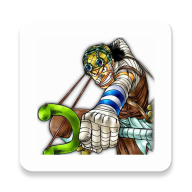
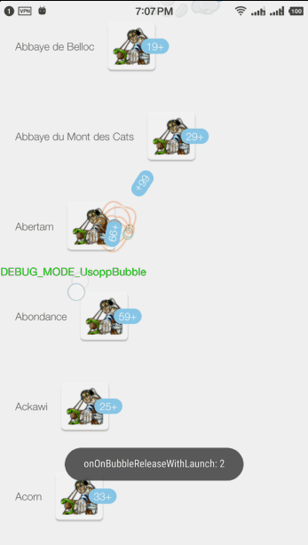
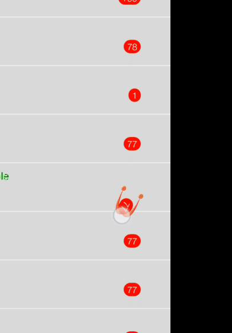
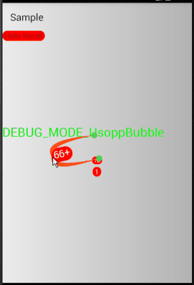

# UsoppBubble

## Not finish yet!

由于此控件实习起来太繁琐，导致极度吃内存，不要用！

仅做练习用；

## How to use

1.Use as a TextView

        <com.halohoop.usoppbubble.widget.UsoppBubble
            android:id="@+id/bubble"
            android:textColor="@android:color/white"
            android:layout_width="wrap_content"
            android:layout_height="wrap_content"
            android:layout_gravity="right|center_vertical"
            android:background="@drawable/bg_blue"
            android:text="1111" />

2.Use setCount(int) method to set a number instead of using setText(String);

3.Use the two option below as a background:

* @drawable/bg_blue
* @drawable/bg

4.Use app:drag_background_color to set the Dragging Bubble background color to match the background above.

## License

    Copyright 2017, Halohoop

    Licensed under the Apache License, Version 2.0 (the "License");
    you may not use this file except in compliance with the License.
    You may obtain a copy of the License at

       http://www.apache.org/licenses/LICENSE-2.0

    Unless required by applicable law or agreed to in writing, software
    distributed under the License is distributed on an "AS IS" BASIS,
    WITHOUT WARRANTIES OR CONDITIONS OF ANY KIND, either express or implied.
    See the License for the specific language governing permissions and
    limitations under the License.